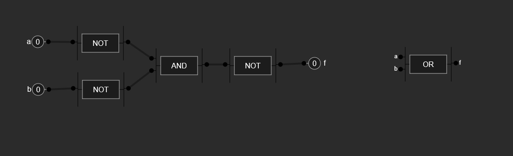
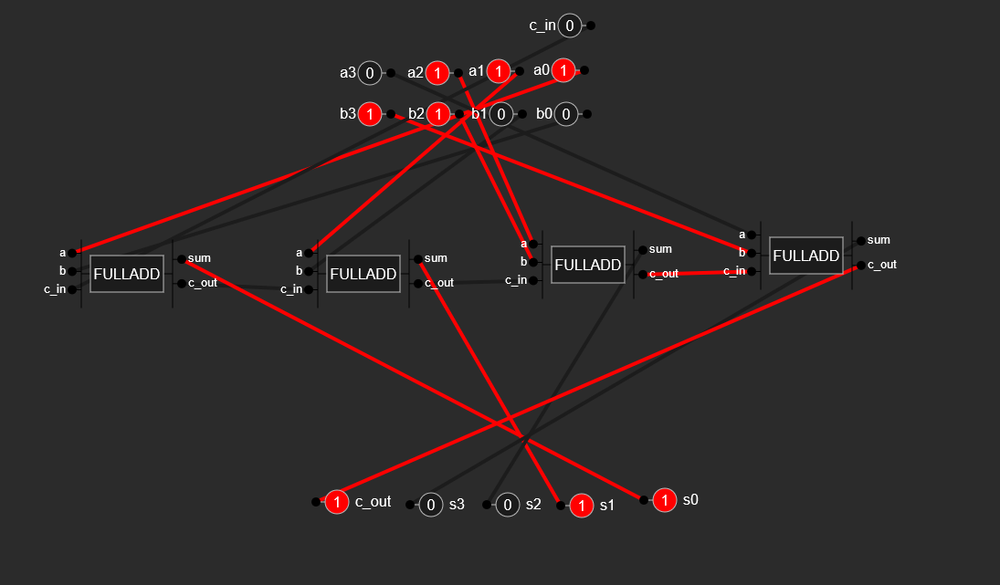
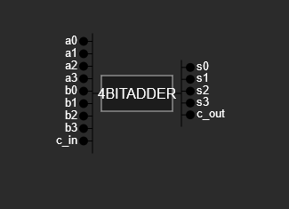

# Circuit Visualization
Sparking insperation from [Logisim](http://www.cburch.com/logisim/), I decided that I wanted to take on the challenge of making my own circuit builder. Of course, it has way fewer features compared to Logisim, but I still think that it was a good challenge to build up this logic.

### What it's all about
When you open the website, you start with only the most basic of logic gates and utilites. You are given your **Input** and **Output** pins, along with **AND** and **NOT** gates. From there, since these are functionally complete components, you are free to build whatever circuit you want.

Bellow is a the transformation of an OR gate, from  three **NOT** gates and one **AND** gate.

A bit more complex, building a four bit adder from 4 sets of full adders.

From

To  

## Issues
- Occasionally, when connecting nodes together, the whole connection system will break, not allowing you to connect anything else. To fix this, you can either modify the variables using the console, or just reload the page. ***WARNING***: Reloading the page will remove all circuits you created. State is not stored.

- Text overflows in circuit block if text is too long.
- Pins may be too small